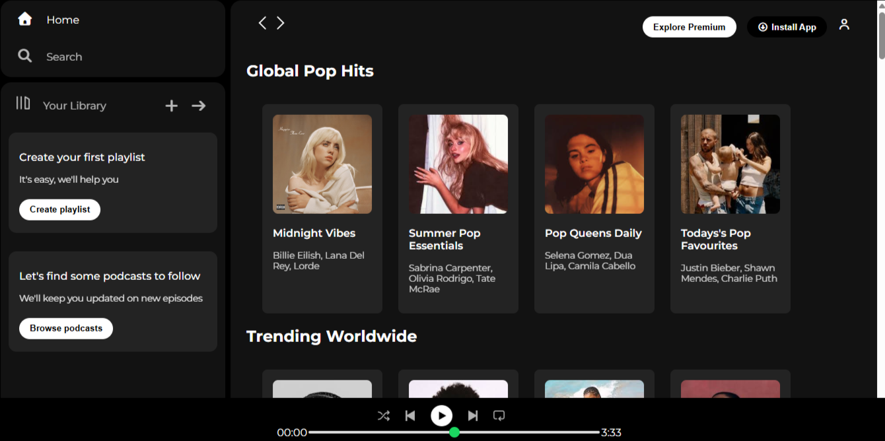

# 🎵 Spotify UI Clone

A **Spotify-inspired web player interface** built using **HTML** and **CSS**. This project recreates the desktop layout of Spotify, including the sidebar, navigation bar, playlist sections, and music player.

---

## ✨ Features

- 🎨 Spotify-inspired desktop interface
- 🎵 Sidebar navigation
- 💿 Playlist and album cards
- ▶️ Music player section
- 🖱️ Interactive hover effects
- 📂 Clean and organized layout

---

## 🛠️ Tech Stack

- HTML5
- CSS3
- Font Awesome
- Google Fonts

---

## 📂 Project Structure

```text
spotify-ui-clone/
│
├── assets/
├── index.html
├── style.css
└── README.md
```

---

## 📸 Screenshots

### 🏠 Homepage



---

## 🌐 Live Demo

🔗 https://manasvi-patidar.github.io/spotify-ui-clone/

---

## 👨‍💻 Author

**Manasvi Patidar**

This project was created to practice frontend web development by recreating Spotify's desktop user interface using HTML and CSS.
